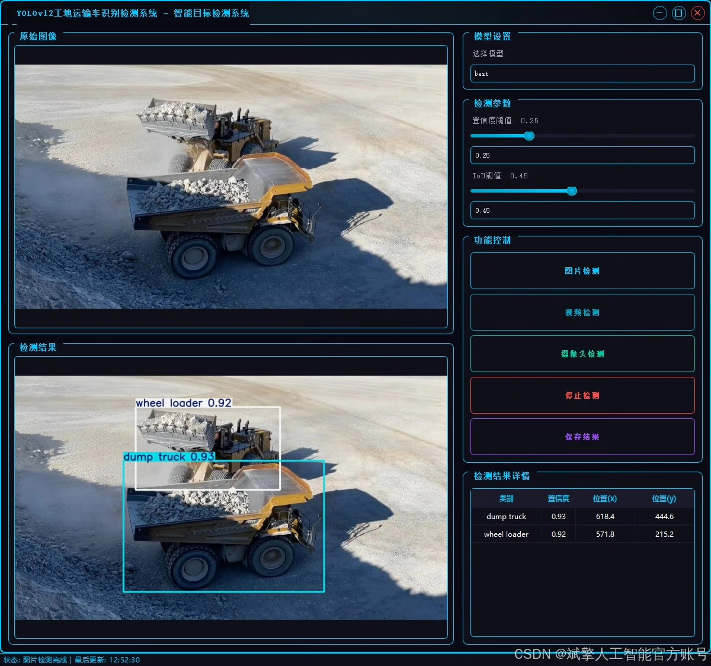
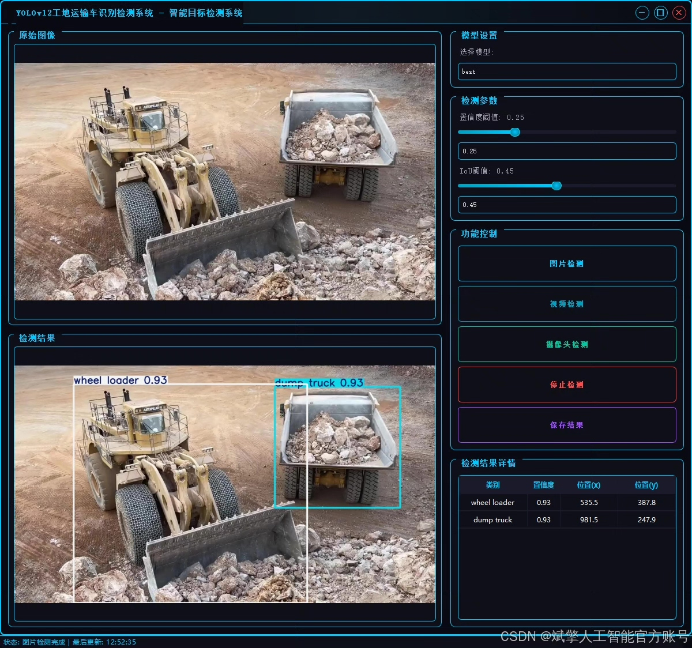
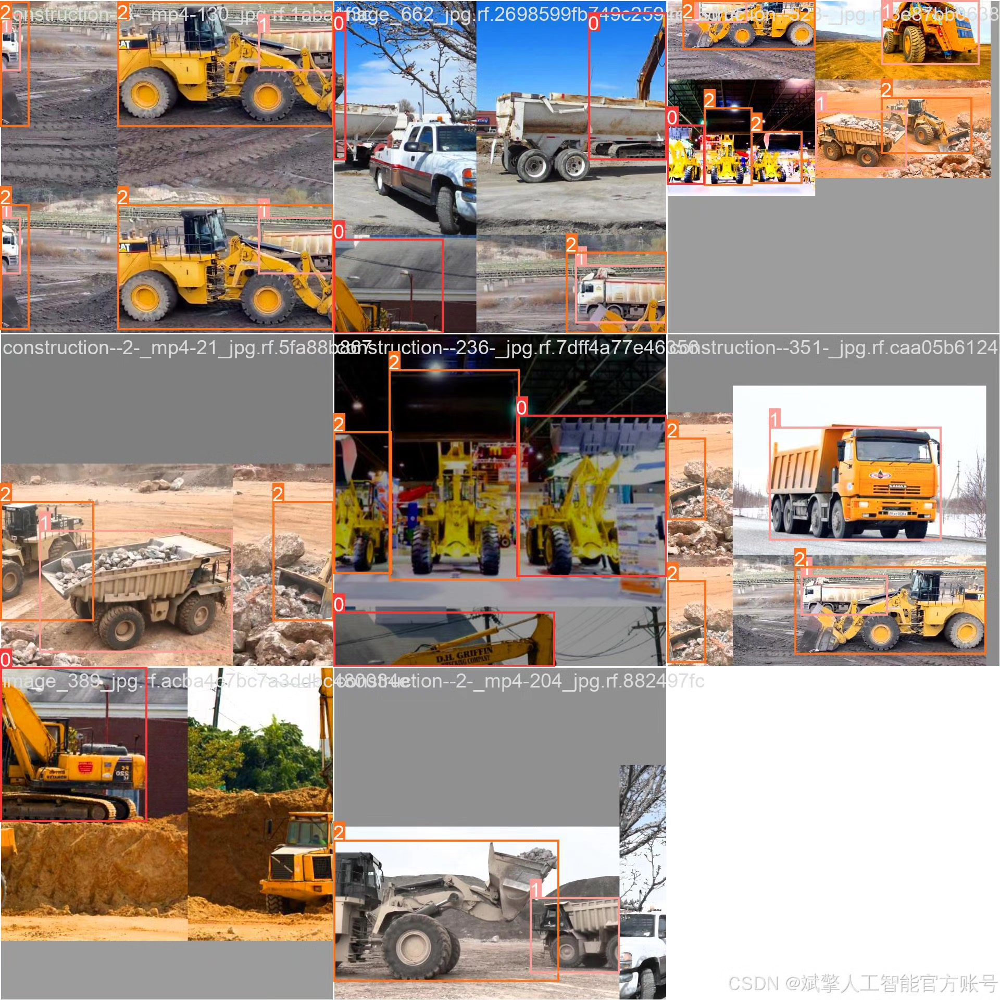
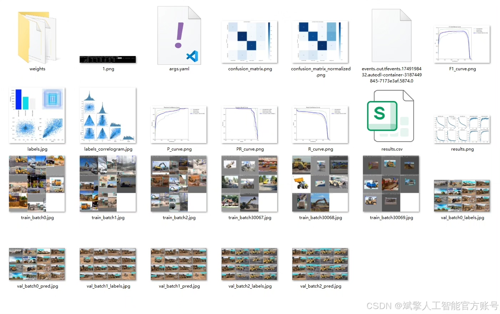
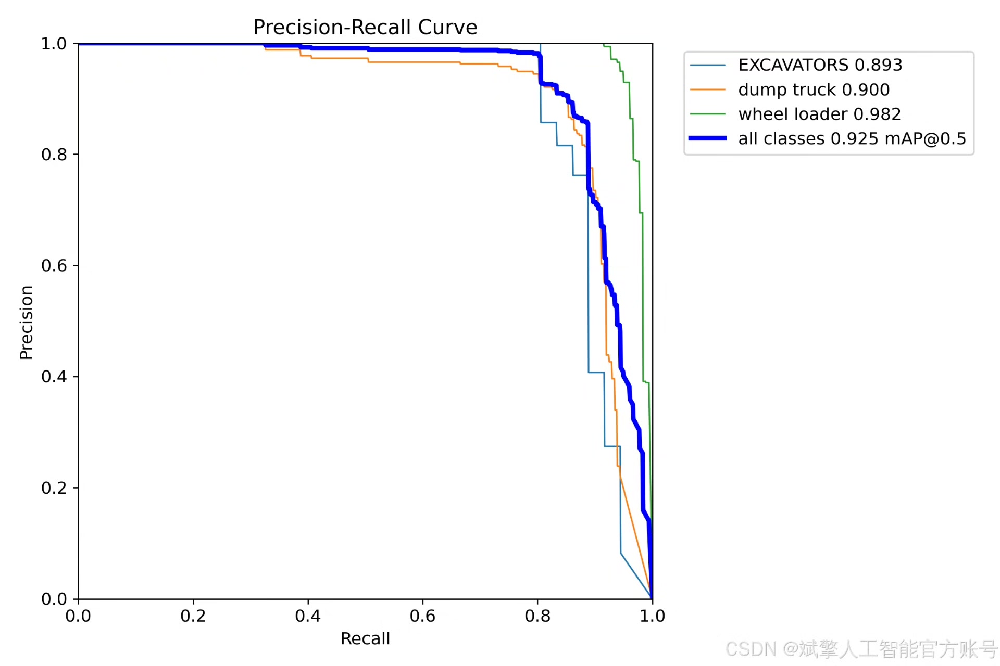
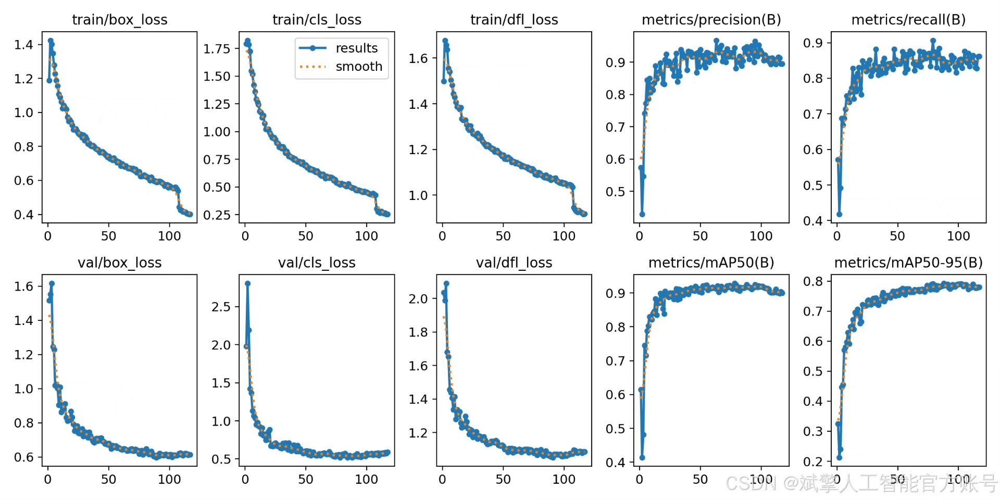
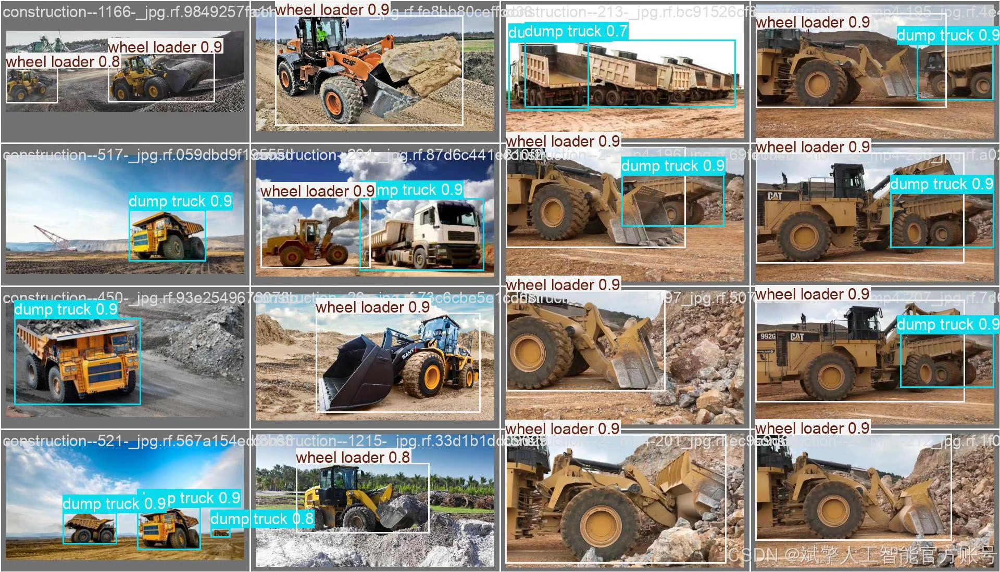

# YOLOv12 construction vehicle recognition system

## Body

YOLOv12 Construction Vehicle Identification System Based on Deep Learning YOLOv12: A Smart Detection System for Construction Vehicles (YOLOv12+YOLO dataset + UI interface + login and registration interface + Python project source code + model)

This paper designs and implements a smart identification detection system for construction vehicles based on the YOLOv12 deep learning algorithm, aiming to enhance the automation level and safety of construction vehicle management. The system targets three common types of engineering vehicles (excavators, dump trucks, wheel loaders), using a YOLO format dataset containing 2244 training images, 267 validation images, and 144 test images for model training and evaluation. By integrating a user-friendly UI interface and login/registration functions, it meets the application needs of actual construction site scenarios. Experimental results show that this system has high detection accuracy and real-time performance in complex construction site environments, providing an effective technical solution for engineering vehicle monitoring, operation scheduling, and safety warnings.

✅ User Login and Registration: Supports password verification and security validation.
✅ Three Detection Modes: Based on the YOLOv12 model, supports image, video, and real-time camera detection, accurately recognizing targets.
✅ Dual-Screen Contrast: Displays the original scene and detection results simultaneously on the screen.
✅ Data Visualization: Real-time table displays the category, confidence, and coordinates of detected targets.
✅ Intelligent Parameter Tuning: Offers a confidence slide bar to dynamically optimize detection accuracy, adapting to different scene requirements.
✅ Sci-Fi Interactive Interface: Dark theme combined with dynamic light effects, reducing visual fatigue and enhancing operational experience.

## Images

## Payment

Here is a pay link on Stripe ( https://buy.stripe.com/3cs8yP7sY87d0vu9AB ). Please contact me lonlonago@foxmail.com after funding $89, and I will send you a complete data files , thank you!

